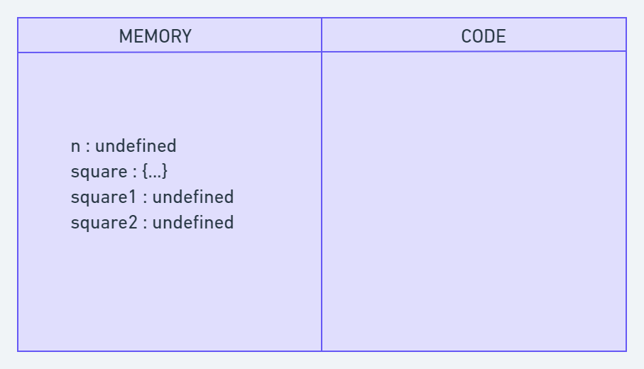

# Execution Context

When the JavaScript engine scans a script file, it makes an environment called the Execution Context that handles the entire transformation and execution of the code.

During the context runtime, the parser parses the source code and allocates memory for the variables and functions. The source code is generated and gets executed.

There are two types of execution contexts: global and function. The global execution context is created when a JavaScript script first starts to run, and it represents the global scope in JavaScript. A function execution context is created whenever a function is called, representing the function's local scope.

## Phases of the JavaScript Execution Context

There are two phases of JavaScript execution context:

1. **Creation phase**: In this phase, the JavaScript engine creates the execution context and sets up the script's environment. It determines the values of variables and functions and sets up the scope chain for the execution context.

2. **Execution phase**: In this phase, the JavaScript engine executes the code in the execution context. It processes any statements or expressions in the script and evaluates any function calls.

Everything in JS happens inside this execution context. It is divided into two components. One is memory and the other is code. It is important to remember that these phases and components are applicable to both global and functional execution contexts.

### Example

```javascript
var n = 5;

function square(n) {
    var ans = n * n;
    return ans;
}

var square1 = square(n);
var square2 = square(8);

console.log(square1);
console.log(square2);
```

### Creation Phase

At the very beginning, the JavaScript engine executes the entire source code, creates a global execution context, and then does the following things:

1. Creates a global object that is window in the browser and global in NodeJs.
2. Sets up a memory for storing variables and functions.
3. Stores the variables with values as undefined and function references.

This is called the creation phase. Here's a diagram to help explain it:



After this creation phase, the execution context will move to the code execution phase.

### Code Execution Phase

Now, in this phase, it starts going through the entire code line by line from top to bottom. As soon as it encounters n = 5, it assigns the value 5 to 'n' in memory. Until now, the value of 'n' was undefined by default.

Then we get to the 'square' function. As the function has been allocated in memory, it directly jumps into the line var square1 = square(n);. square() will be invoked and JavaScript once again will create a new function execution context.


Once the calculation is done, it assigns the value of square in the 'ans' variable that was undefined before. The function will return the value, and the function execution context will be destroyed.

The returned value from square() will be assigned on square1. This happens for square2 also. Once the entire code execution is done completely, the global context will look like this and it will be destroyed also.


